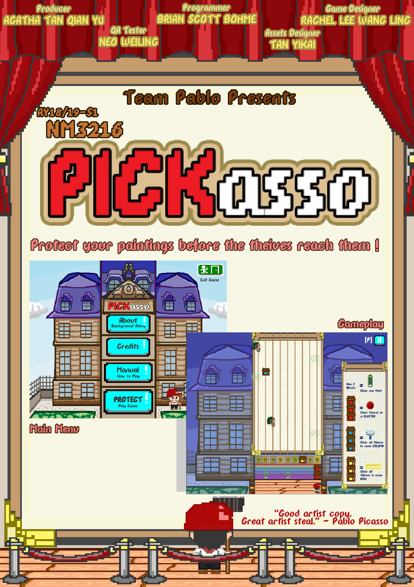
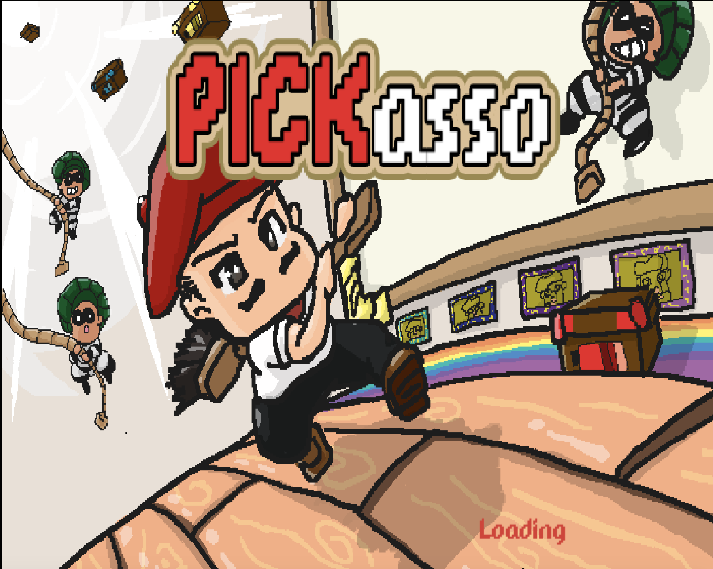
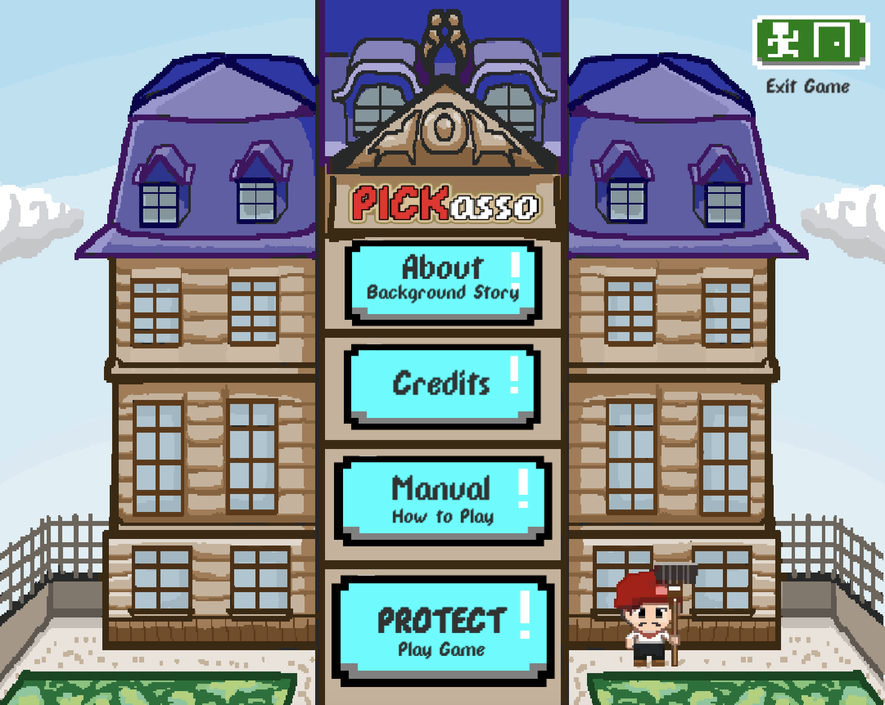
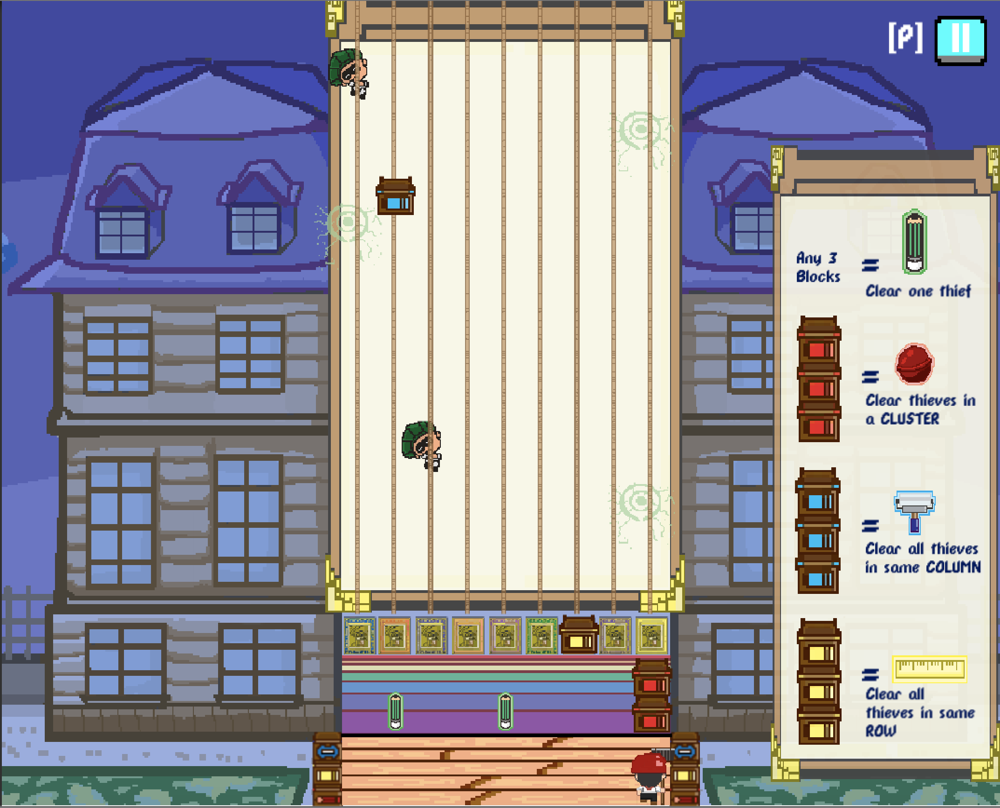

# Pickasso

 
*Promotional poster*

## Game Overview

Pickasso is a single-player action/strategy arcade game, set in a museum modelled after Musée Picasso. The player controls Pickasso, who is attempting to protect his beloved paintings from sneaky thieves. To do so, Pickasso must pick and move the blocks that fall from the top of the canvas map, placing the blocks such that new blocks will land on top of them to form vertical stacks of 3 blocks and thereby forming 1 of the 4 different tools. Pickasso then clears the thieves by throwing these tools straight up at them as they descend on ropes. If any one thief reaches the row of paintings near the bottom of the map, however, the painting is stolen and the game ends. This game is appealing to those who like games that require multitasking and fast-paced action.

Objective: The objective of Pickasso is to protect your paintings by defeating thieves before the thieves reach them. 

Difficulties: The player is challenged to build tools by skillfully shifting blocks along the Rainbow Line of Defence in time for falling blocks to stack on top of them. At the same time, the player is challenged to clear thieves by launching the tools up at them; the player must decide when to prioritize clearing thieves and when to prioritize shifting (stacks of) blocks. They must also choose the appropriate tool to clear the various patterns the thieves spawn in. The rate of spawning thieves and the frequency of falling blocks will also increase as the player clears more and more thieves, at set intervals (e.g. the spawn rate will increase after the player clears 9 thieves).

Juiciness: The juiciness in Pickasso is derived from watching thieves splatter into paint which fills up the canvas with the corresponding colours, clearing whole clusters, columns, or rows of thieves at once, and watching stacks of 3 blocks form a tool (and hearing the accompanying sound effect). Also, even when the player loses the game, they receive the canvas that they have created while clearing thieves as a sort of consolation prize. This further immerses the player into Picasso’s world, by making the player feel like an artist. 

Core Mechanic: Picking and throwing the tools up at the thieves.
Secondary Mechanic: Picking and placing blocks along the Rainbow Line of Defence to form tools.
Ending Condition: The game ends when a thief reaches one of the paintings, in the row right above the Rainbow Line of Defence.

Action Element: Clearing thieves.

Strategy Element: Deciding when and where to move blocks, and deciding which tool to use to clear particular patterns of thieves.

 

Click on the `Pickasso.exe` file to play the game.  
To learn more on the development of the game, click on the `Design Document.pdf` file.

 

 
*SplashScreen*

 

 
*Main Menu*

 

 
*Gameplay*